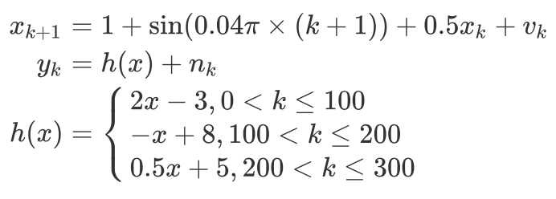

# DyEnsemble

### 0 Introduction

This repository is a simple implementation of **Dynamic Ensemble Model(DyEnsemble)** which is published at NIPS 2019.

> Qi, Y., Liu, B., Wang, Y., & Pan, G. (2019). Dynamic ensemble modeling approach to nonstationary neural decoding in Brain-computer interfaces. In Advances in Neural Information Processing Systems (pp. 6089-6098).

### 1 Design and Usage

The Dynamic Ensemble Model is implemented as class `DyEnsemble` which is modified from class `ParticleFilter`. In order to represent transition and measurement models(functions) in DyEnsemble, I create two abstract base classes named `DyEnsenmbelTModel` and `DyEnsenmbelMModel`, respectively.

Now, I will use an example to show you how to use my `DyEnsemble` with codes in `main.py`.

**Firstly**, create customed transition functions and measurement functions by inheriting `DyEnsenmbelTModel` and `DyEnsenmbelMModel`. In this example, transition functions and measurement functions are shown as follows.



**Secondly**, generate simulation data.

**Thirdly**, create DyEnsemble.

```python
# model = DyEnsemble(x_dim, z_dim, t_model, *m_models)
model = DyEnsemble(x_dim, z_dim, F(x_dim, step), H1(z_dim), H2(z_dim), H3(z_dim))
```

**Finally**, use DyEnsemble.

```python
# model(x_idle, z, n_particle, alpha, save_pm=True):
model(0, y, 200, alpha[i], save_pm=True)
```

### 2 Results

Run `main.py` by `python main.py`, then you will get a figure in which each row represents the posterior probability of each mesurement model(function), and different columns represent different `alpha`.

